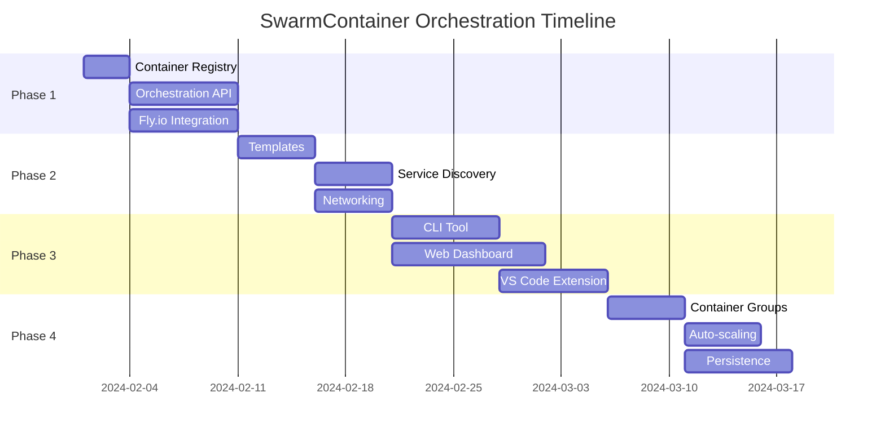

# SwarmContainer Orchestration Implementation Plan

## Executive Summary

This plan outlines how to evolve SwarmContainer from a single-user development environment to a multi-container orchestration platform, enabling use cases like:
- Multiple development environments per user
- Team collaboration spaces
- AI agent swarms
- Distributed development workflows

## Current State

We have successfully implemented:
- ✅ Single SwarmContainer deployment on Fly.io
- ✅ SSH access and VS Code integration
- ✅ Cost monitoring and auto-stop
- ✅ Persistent storage
- ✅ MCP server support

## Vision: SwarmContainer Orchestration

Transform SwarmContainer into a platform that can:
1. Spawn multiple containers on demand
2. Manage container lifecycle (create, stop, destroy)
3. Enable inter-container communication
4. Provide container discovery and routing
5. Support different container roles/configurations
6. Scale efficiently with cost controls

## Implementation Phases

### Phase 1: Foundation (Week 1-2)
**Goal**: Build orchestration primitives on Fly.io

#### 1.1 Container Registry
- [ ] Push SwarmContainer image to Fly.io registry
- [ ] Version tagging strategy
- [ ] Multi-architecture support (AMD64/ARM64)

#### 1.2 Orchestration API
- [ ] Create `swarm-orchestrator` service
- [ ] RESTful API for container management
- [ ] Authentication/authorization layer
- [ ] Container metadata storage

#### 1.3 Fly.io Machines Integration
- [ ] Wrapper around Fly Machines API
- [ ] Container lifecycle management
- [ ] Resource allocation logic
- [ ] Network configuration

### Phase 2: Core Features (Week 3-4)
**Goal**: Enable multi-container workflows

#### 2.1 Container Templates
```yaml
# swarm-templates.yaml
templates:
  development:
    size: "shared-cpu-1x"
    memory: 512
    env:
      - SECURITY_PRESET=development
    features:
      - mcp
      - claude-code
  
  agent:
    size: "shared-cpu-2x"
    memory: 2048
    env:
      - SECURITY_PRESET=paranoid
    features:
      - mcp
      - agent-framework
```

#### 2.2 Service Discovery
- [ ] Internal DNS setup
- [ ] Container registry service
- [ ] Health checking
- [ ] Automatic failover

#### 2.3 Inter-Container Networking
- [ ] Private network setup (Fly 6PN)
- [ ] Service mesh configuration
- [ ] Port forwarding rules
- [ ] Security groups

### Phase 3: Management Layer (Week 5-6)
**Goal**: User-friendly orchestration tools

#### 3.1 CLI Tool
```bash
# swarm-cli commands
swarm create --name dev-env-1 --template development
swarm list
swarm connect dev-env-1
swarm stop dev-env-1
swarm destroy dev-env-1
```

#### 3.2 Web Dashboard
- [ ] Container status overview
- [ ] Resource usage metrics
- [ ] Cost tracking per container
- [ ] One-click operations

#### 3.3 VS Code Extension
- [ ] Multi-container workspace support
- [ ] Container switcher
- [ ] Integrated terminal routing
- [ ] Resource monitoring

### Phase 4: Advanced Features (Week 7-8)
**Goal**: Production-ready orchestration

#### 4.1 Container Groups
```yaml
# Example: AI Agent Swarm
group: ai-research-team
containers:
  - name: coordinator
    template: agent
    role: master
  - name: researcher-1
    template: agent
    role: worker
  - name: researcher-2
    template: agent
    role: worker
```

#### 4.2 Automated Scaling
- [ ] Load-based scaling rules
- [ ] Cost-based limits
- [ ] Schedule-based scaling
- [ ] Auto-cleanup policies

#### 4.3 Persistence Layer
- [ ] Shared volumes between containers
- [ ] Backup/restore functionality
- [ ] Data migration tools
- [ ] Snapshot management

## Technical Architecture

### Orchestrator Service
```typescript
// orchestrator/src/index.ts
interface SwarmOrchestrator {
  // Container lifecycle
  createContainer(config: ContainerConfig): Promise<Container>
  stopContainer(id: string): Promise<void>
  destroyContainer(id: string): Promise<void>
  
  // Container discovery
  listContainers(filter?: Filter): Promise<Container[]>
  getContainer(id: string): Promise<Container>
  
  // Group management
  createGroup(config: GroupConfig): Promise<ContainerGroup>
  scaleGroup(groupId: string, replicas: number): Promise<void>
}
```

### Container Metadata Schema
```typescript
interface Container {
  id: string
  name: string
  state: 'running' | 'stopped' | 'creating' | 'destroying'
  template: string
  resources: {
    cpu: number
    memory: number
    storage: number
  }
  network: {
    privateIp: string
    publicDns: string
    ports: Port[]
  }
  metadata: {
    owner: string
    created: Date
    lastAccessed: Date
    costPerHour: number
  }
}
```

### API Endpoints
```yaml
# Orchestrator API
POST   /api/containers          # Create container
GET    /api/containers          # List containers
GET    /api/containers/:id      # Get container details
PUT    /api/containers/:id      # Update container
DELETE /api/containers/:id      # Destroy container
POST   /api/containers/:id/stop # Stop container
POST   /api/containers/:id/start # Start container

# Group API
POST   /api/groups              # Create group
GET    /api/groups              # List groups
PUT    /api/groups/:id/scale    # Scale group
```

## Cost Optimization Strategy

### Container Pricing Tiers
| Tier | CPU | Memory | Storage | Est. Cost/month |
|------|-----|--------|---------|-----------------|
| Micro | 0.25 | 256MB | 5GB | ~$1.50 |
| Small | 1 | 512MB | 10GB | ~$3.00 |
| Medium | 2 | 2GB | 20GB | ~$6.00 |
| Large | 4 | 4GB | 40GB | ~$12.00 |

### Cost Controls
1. **Default auto-stop**: 30 minutes idle
2. **Maximum containers per user**: Configurable
3. **Budget alerts**: Per-user and global
4. **Resource quotas**: CPU/memory limits

## Migration Path

### From Single to Multi-Container
1. Keep existing single-container setup working
2. Add orchestration as optional feature
3. Gradual migration tools
4. Backward compatibility

### Platform Portability
Design for platform independence:
- Abstract Fly.io specifics
- Support for Kubernetes backend
- Docker Swarm compatibility
- Local development mode

## Success Metrics

### Phase 1 Success Criteria
- [ ] Can spawn 3 containers via API
- [ ] Containers can communicate
- [ ] Basic lifecycle management works

### Phase 2 Success Criteria
- [ ] Service discovery functioning
- [ ] Templates reduce setup time by 80%
- [ ] Inter-container latency < 5ms

### Phase 3 Success Criteria
- [ ] CLI adoption by 50% of users
- [ ] Dashboard uptime > 99%
- [ ] VS Code extension 4+ star rating

### Phase 4 Success Criteria
- [ ] Support 100+ containers
- [ ] Auto-scaling reduces costs by 40%
- [ ] Zero data loss in persistence layer

## Risk Mitigation

### Technical Risks
| Risk | Impact | Mitigation |
|------|--------|------------|
| Fly.io API limits | High | Implement rate limiting, caching |
| Network complexity | Medium | Start with simple topology |
| Cost overruns | High | Strict quotas, monitoring |

### Operational Risks
| Risk | Impact | Mitigation |
|------|--------|------------|
| Security breaches | High | Network isolation, audit logs |
| Data loss | High | Automated backups, snapshots |
| Platform lock-in | Medium | Abstract platform layer |

## Timeline Summary



## Next Steps

1. **Validate Approach**: Test Fly.io Machines API limits
2. **Create Proof of Concept**: 3-container demo
3. **Gather Feedback**: User requirements survey
4. **Finalize Design**: Architecture review
5. **Begin Phase 1**: Container registry setup

## Conclusion

This plan transforms SwarmContainer from a single-user tool to a powerful orchestration platform while maintaining simplicity and cost-effectiveness. The phased approach allows for validation at each step and maintains backward compatibility.

The implementation leverages our existing Fly.io work while building abstractions that enable future platform portability. By focusing on developer experience and cost optimization, we can create a unique solution in the development container orchestration space.